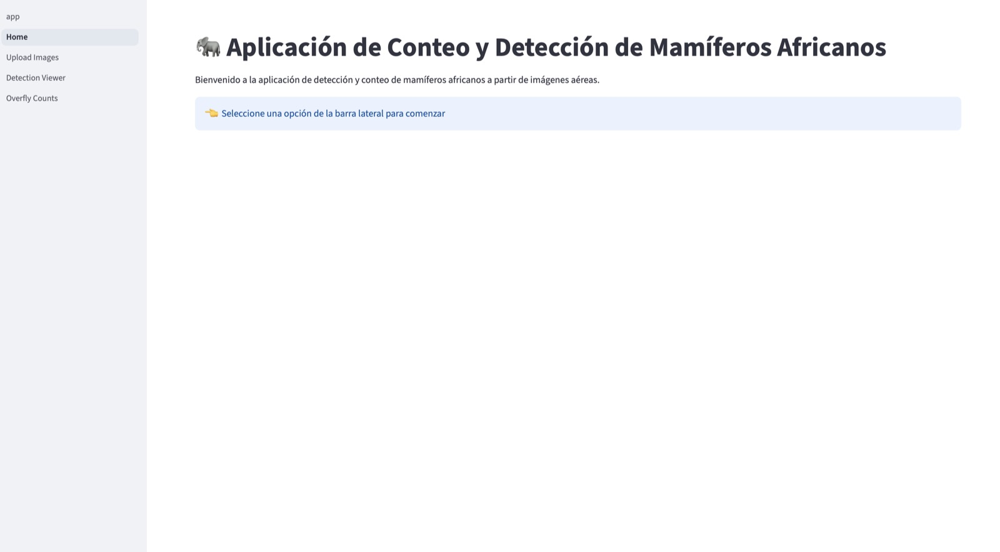
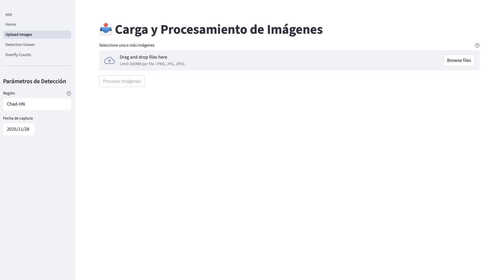
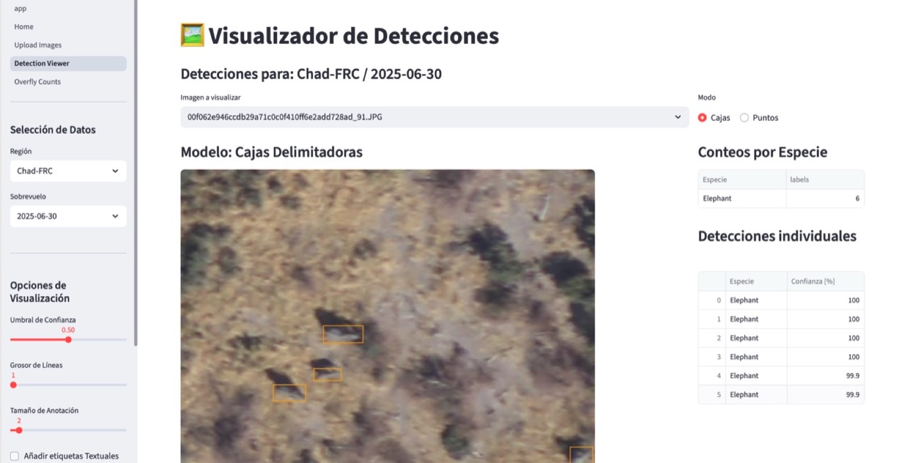
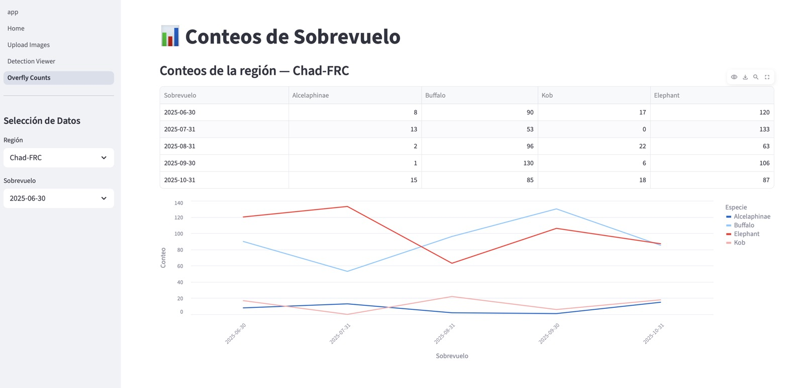
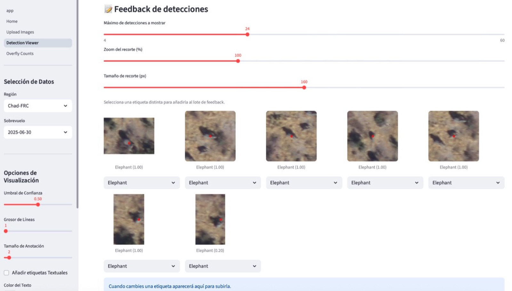

<div id="top"></div>

<div align="center">
  <h1>Proyecto de Grado MAIA 2025 — Detección y Conteo de Animales</h1>
  <p>
    Pipeline de deep learning para detección y conteo de manadas en imágenes aéreas.<br/>
    Modelos HerdNet + Faster R-CNN, servicio de inferencia FastAPI y dashboard en Streamlit.
  </p>
  <p>
    <a href="#inicio-rapido">Inicio rápido</a> ·
    <a href="#uso">Uso API</a> ·
    <a href="#guia-del-dashboard">Guía Dashboard</a> ·
    <a href="#hoja-de-ruta">Hoja de ruta</a>
  </p>
  <p>
    
    
    
    
    
  </p>
</div>

## Tabla de Contenidos
1. [Sobre el proyecto](#sobre-el-proyecto)
2. [Tecnologías](#tecnologias)
3. [Carpetas relevantes](#carpetas-relevantes)
4. [Guía para desarrolladores](#guia-para-desarrolladores)
5. [Inicio rápido](#inicio-rapido)
6. [Uso](#uso)
7. [Guía del Dashboard](#guia-del-dashboard)
8. [Contacto](#contacto)
9. [Agradecimientos](#agradecimientos)

## Sobre el proyecto
- Objetivo: Detectar y contar mamíferos africanos (datasets Virunga + AED) en manadas densas desde imágenes aéreas.
- Modelos: HerdNet (puntos/densidad) y Faster R-CNN (cajas), con variantes de entrenamiento (p.ej., HN-4, FRC-50/101).

[↑ volver arriba](#top)

## Tecnologías
- Python, PyTorch, Torchvision
- DVC para versionado de datos/modelos
- Hydra (HerdNet), Pydantic/FastAPI para la API
- Streamlit para el dashboard
- Docker para empaquetar API/UI
[↑ volver arriba](#top)

## Carpetas relevantes
- `datos/`: README con cómo bajar datos via DVC y enlace a carpeta con datos de muestra en Drive.
- `modelos/`: README con enlaces externos (OneDrive) y comandos DVC.
- `notebooks/` y `marimo-nbs/`: notebooks de análisis, entrenamiento y pruebas.
- `data/`: datos y modelos gestionados por DVC (no subir pesados a Git).
[↑ volver arriba](#top)

## Guía para desarrolladores

### Setup con uv
```bash
uv python install          # usa .python-version
uv sync --all-extras       # instala dependencias
source .venv/bin/activate
- Instalar hooks: `pre-commit install`
- Lint/type-check: `poe check`, `poe type-check`
- Tests end-to-end:

  poe e2e predict-one
  poe e2e predict-many
  
```

### Datos y modelos (DVC)
- Mínimo para inferencia (HN):
  ```bash
  dvc pull data/models/herdnet_v2_hn2/best_model.pth
  dvc pull data/groundtruth data/train data/val data/test
  ```
- Mínimo para Faster R-CNN (ResNet50):
  ```bash
  dvc pull data/models/faster-rcnn/resnet50-100-epochs-tbl4/best_model.pth
  ```
- Opcional: trae parches/resultados según los stages de `dvc.yaml` (ej. `dvc pull data/patches-512-ol-160-m01`).

### Levantar backend
- Local: `poe serve-hn` (HerdNet) o `poe serve-frc` (FRC) — API en `http://localhost:8000`.
- Docker: `poe dockerize-api` y luego `poe docker-run-api` ,

### Mapa del repo 
- `api/` Servicio FastAPI (entry: `api/main.py`, tareas/config en `pyproject.toml`).
- `dashboard/` UI Streamlit (`app.py`, `pages/`, utilidades en `utils/`).
- `oficial_herdnet/` Scripts/config Hydra para entrenar HerdNet.
- `configs/` Configs de modelos/test (API y entrenamiento).
- `data/` Datos, groundtruths y modelos manejados por DVC.
- `dvc.yaml` Pipelines de train/test/inferencia; `dvc.lock` versiones fijadas.
- `pyproject.toml` Dependencias, tareas `poe`, tooling.
- `notebooks/`, `marimo-nbs/` Exploración y experimentos.
- `animaloc_improved/` Utilidades de inferencia/minado de hard-negatives.

### Comandos mínimos de entrenamiento
- Ejemplo HerdNet (train/test):
  ```bash
  uv run dvc repro train-herdnet-v4
  uv run dvc repro test-herdnet-v4-full-imgs
  ```
- Asegura previamente los insumos de los stages (parches/gt) con `dvc pull`.
[↑ volver arriba](#top)


poe e2e predict-one-mult
  

## Inicio rápido
### Prerrequisitos críticos
1. **Credenciales AWS** (obligatorio)
   - Solicita acceso al equipo para obtener:
     - AWS Access Key ID
     - AWS Secret Access Key
   - Buckets usados:
     - `mammals-detect-dvc` (modelos/datos vía DVC)
     - `cow-detect-maia` (imágenes/resultados)

2. **Herramientas del sistema**
   - Git
   - Python 3.13+ (se instalará vía `uv`)
   - [uv](https://docs.astral.sh/uv/getting-started/installation/)

### Configuración AWS
Configura tus credenciales AWS con el perfil requerido por DVC:
```bash
aws configure --profile dvc-user

```


### Clonar repositorio
```bash
git clone https://github.com/maia-2025-vision/proyecto-de-grado.git
cd proyecto-de-grado
```

### Instalar dependencias y datos mínimos
```bash
uv python install
uv sync --all-extras
source .venv/bin/activate
dvc pull data/models/herdnet_v2_hn2/best_model.pth
dvc pull data/models/faster-rcnn/resnet50-100-epochs-tbl4/best_model.pth
dvc pull data/groundtruth data/train data/val data/test
```

**Opcional: Instalar proyecto en modo editable**
Esto evita errores de importación (`ModuleNotFoundError`) al ejecutar scripts desde directorios que no sean la raíz.
```bash
uv pip install -e .
```

### Variables de entorno clave
- `MODEL_WEIGHTS_PATH`: ruta al modelo. Valores por defecto:
  - HerdNet (`poe serve-hn` / `docker-run-api`): `data/models/herdnet_v2_hn2/best_model.pth`
  - Faster R-CNN (`poe serve-frc`): `data/models/faster-rcnn/resnet50-100-epochs-tbl4/best_model.pth`
- `MODEL_CFG_PATH`: configuración asociada (por defecto `configs/test/herdnet.yaml` o `configs/test/faster_rcnn.yaml`).
- `AWS_PROFILE`: perfil para credenciales AWS (por defecto `dvc-user` en `docker-run-api`). Alternativa: exportar `AWS_ACCESS_KEY_ID` y `AWS_SECRET_ACCESS_KEY`.

### Ejecutar servicios
```bash
# API (elige uno)
poe serve-hn   # HerdNet
poe serve-frc  # Faster-RCNN

# Dashboard
poe start-dashboard

# Builds Docker
poe dockerize-api
poe dockerize-dashboard
```

Las rutas de modelo/config de la API están en `pyproject.toml` bajo `[tool.poe.tasks.serve-*]` (`MODEL_WEIGHTS_PATH`, `MODEL_CFG_PATH`).
[↑ volver arriba](#top)

## Uso
### API (FastAPI)
- Docs: http://localhost:8000/docs
- Endpoint principal: `POST /predict` recibe una imagen y devuelve detecciones/centroides por especie.
```bash
curl -X POST "http://localhost:8000/predict" \
  -H "accept: application/json" \
  -H "Content-Type: multipart/form-data" \
  -F "file=@/ruta/a/imagen.jpg"
```
[↑ volver arriba](#top)

## Guía del Dashboard
- Arrancar: `poe start-dashboard` (API en `localhost:8000`). Docker: `poe dockerize-dashboard` -> `poe docker-run-dashboard` (http://localhost:8501).
- Pasos:
  1) Bienvenida — Navegar por la barra lateral.  
     
  2) Cargar y procesar — Define Región y fecha; clic en “Upload”.  
     
  3) Visualizar resultados — Elige Región y Fecha (Sobrevuelo), luego “Cargar Resultados” y elegir el modo de visualización (puntos o cajas si disponible).  
     
  4) Métricas — Métricas de las detecciones.  
       
     
  5) Ajustar detecciones — Elige una detección errada en para corregirla.  
     

[↑ volver arriba](#top)


## Contacto
- Andrés Alea — a.alea@uniandes.edu.co
- Mixer Gutiérrez — mf.gutierreza1@uniandes.edu.co
- Jose Daniel Pineda — jd.pineda@uniandes.edu.co
- Mateo Restrepo — m.restrepom2@uniandes.edu.co
[↑ volver arriba](#top)

## Agradecimientos
Los autores quisieran agradecer al profesor Isaí Daniel
Chacón, de la Universidad de los Andes, por los valiosos
consejos e indicaciones nos brindó durante la realización de
este trabajo.
[↑ volver arriba](#top)
## Referencias
- Repo HerdNet de Alexandre Delplanque (base de entrenamiento)
- Datasets: Virunga + Aerial Elephant Dataset
- Herramientas: DVC, W&B, Streamlit, FastAPI
[↑ volver arriba](#top)
