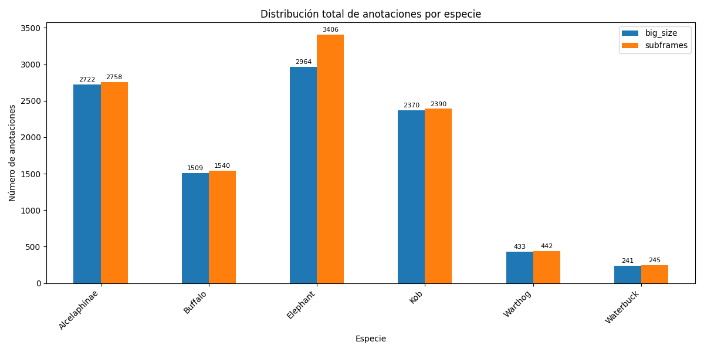
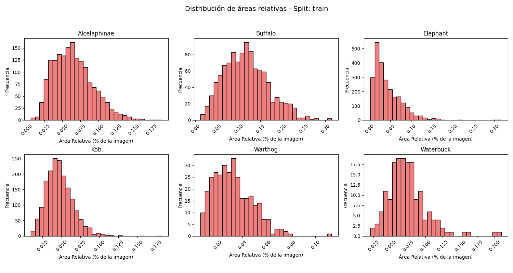
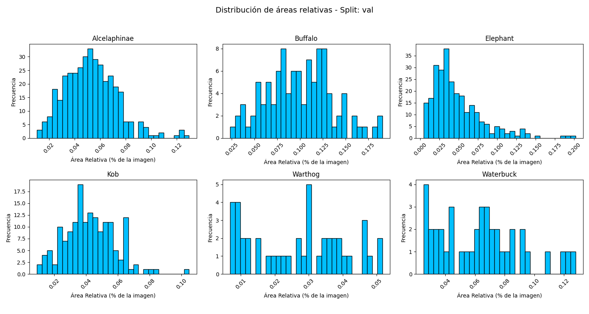
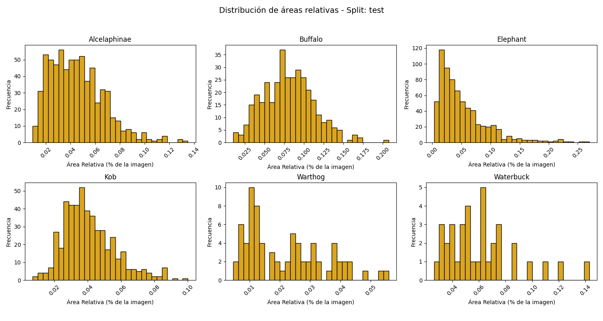

# Exploración de Datos

## Dataset: `big_size`

### Split: `train`

- **Número de imágenes**: 928
- **Número de anotaciones**: 6962
- **Tamaños únicos de imagen**:
  - 5472x3648
  - 5496x3670
  - 5521x3687
  - 5525x3690
  - 6000x4000

**Distribución por especie:**

| Especie      |   Anotaciones |
|:-------------|--------------:|
| Kob          |          1732 |
| Buffalo      |          1058 |
| Warthog      |           316 |
| Waterbuck    |           166 |
| Alcelaphinae |          1678 |
| Elephant     |          2012 |

### Split: `val`

- **Número de imágenes**: 111
- **Número de anotaciones**: 978
- **Tamaños únicos de imagen**:
  - 5472x3648
  - 5496x3670
  - 5521x3687
  - 5525x3690
  - 6000x4000

**Distribución por especie:**

| Especie      |   Anotaciones |
|:-------------|--------------:|
| Warthog      |            43 |
| Buffalo      |           102 |
| Alcelaphinae |           369 |
| Kob          |           161 |
| Waterbuck    |            39 |
| Elephant     |           264 |

### Split: `test`

- **Número de imágenes**: 258
- **Número de anotaciones**: 2299
- **Tamaños únicos de imagen**:
  - 5472x3648
  - 5496x3670
  - 5525x3690
  - 6000x4000

**Distribución por especie:**

| Especie      |   Anotaciones |
|:-------------|--------------:|
| Kob          |           477 |
| Buffalo      |           349 |
| Warthog      |            74 |
| Alcelaphinae |           675 |
| Waterbuck    |            36 |
| Elephant     |           688 |

## Dataset: `subframes`

### Split: `train`

- **Número de imágenes**: 1724
- **Número de anotaciones**: 7461
- **Tamaños únicos de imagen**:
  - 2000x2000

**Distribución por especie:**

| Especie      |   Anotaciones |
|:-------------|--------------:|
| Kob          |          1745 |
| Buffalo      |          1080 |
| Warthog      |           323 |
| Waterbuck    |           169 |
| Alcelaphinae |          1701 |
| Elephant     |          2443 |

### Split: `val`

- **Número de imágenes**: 666
- **Número de anotaciones**: 994
- **Tamaños únicos de imagen**:
  - 1472x1648
  - 1472x2000
  - 1496x1670
  - 1496x2000
  - 1521x1687
  - 1521x2000
  - 1525x1690
  - 1525x2000
  - 2000x1648
  - 2000x1670
  - 2000x1687
  - 2000x1690
  - 2000x2000

**Distribución por especie:**

| Especie      |   Anotaciones |
|:-------------|--------------:|
| Warthog      |            44 |
| Buffalo      |           104 |
| Alcelaphinae |           376 |
| Kob          |           163 |
| Waterbuck    |            40 |
| Elephant     |           267 |

### Split: `test`

- **Número de imágenes**: 1548
- **Número de anotaciones**: 2326
- **Tamaños únicos de imagen**:
  - 1472x1648
  - 1472x2000
  - 1496x1670
  - 1496x2000
  - 1525x1690
  - 1525x2000
  - 2000x1648
  - 2000x1670
  - 2000x1690
  - 2000x2000

**Distribución por especie:**

| Especie      |   Anotaciones |
|:-------------|--------------:|
| Kob          |           482 |
| Buffalo      |           356 |
| Warthog      |            75 |
| Alcelaphinae |           681 |
| Waterbuck    |            36 |
| Elephant     |           696 |

## Comparación Total por Especie

## Distribución de Áreas de Bounding Boxes por Clase

### Histograma de Áreas - Split `train`

### Histograma de Áreas - Split `val`

### Histograma de Áreas - Split `test`

## Estadísticas Descriptivas de Áreas

### Estadísticas de Áreas Absolutas (px²)

| category     |   count |    mean |     std |   min |   25% |    50% |     75% |   max |
|:-------------|--------:|--------:|--------:|------:|------:|-------:|--------:|------:|
| Alcelaphinae |    2758 | 2348.86 | 1067.16 |   230 |  1558 | 2240   | 2964    |  7560 |
| Buffalo      |    1540 | 4305.4  | 1946.86 |   420 |  2886 | 4097.5 | 5472    | 12573 |
| Elephant     |    3406 | 1688.6  | 1315.51 |    72 |   731 | 1308   | 2304    | 12648 |
| Kob          |    2390 | 1836.06 |  703.79 |   280 |  1350 | 1750   | 2235.25 |  7300 |
| Warthog      |     442 | 1199.87 |  633.79 |   187 |   685 | 1137   | 1584.5  |  4536 |
| Waterbuck    |     245 | 2809.03 | 1134.87 |   816 |  2091 | 2684   | 3304    |  8393 |

### Estadísticas de Áreas Relativas (% de imagen)

| category     |   count |   mean |    std |    min |    25% |    50% |    75% |    max |
|:-------------|--------:|-------:|-------:|-------:|-------:|-------:|-------:|-------:|
| Alcelaphinae |    2758 | 0.0587 | 0.0267 | 0.0058 | 0.039  | 0.056  | 0.0741 | 0.189  |
| Buffalo      |    1540 | 0.1076 | 0.0487 | 0.0105 | 0.0722 | 0.1024 | 0.1368 | 0.3143 |
| Elephant     |    3406 | 0.045  | 0.0359 | 0.0018 | 0.0192 | 0.0348 | 0.0619 | 0.3162 |
| Kob          |    2390 | 0.0459 | 0.0176 | 0.007  | 0.0338 | 0.0438 | 0.0559 | 0.1825 |
| Warthog      |     442 | 0.03   | 0.0158 | 0.0047 | 0.0171 | 0.0284 | 0.0396 | 0.1134 |
| Waterbuck    |     245 | 0.0702 | 0.0284 | 0.0204 | 0.0523 | 0.0671 | 0.0826 | 0.2098 |

### Estadísticas de Áreas Relativas por Split (% de imagen)

#### Split: `train`

|                           |   count |   mean |    std |    min |    25% |    50% |    75% |    max |
|:--------------------------|--------:|-------:|-------:|-------:|-------:|-------:|-------:|-------:|
| ('train', 'Alcelaphinae') |    1701 | 0.0653 | 0.0274 | 0.0058 | 0.0444 | 0.0624 | 0.082  | 0.189  |
| ('train', 'Buffalo')      |    1080 | 0.1173 | 0.0508 | 0.0122 | 0.079  | 0.114  | 0.1494 | 0.3143 |
| ('train', 'Elephant')     |    2443 | 0.0427 | 0.0338 | 0.0018 | 0.0178 | 0.0326 | 0.0598 | 0.3162 |
| ('train', 'Kob')          |    1745 | 0.0476 | 0.018  | 0.0094 | 0.0352 | 0.0459 | 0.0576 | 0.1825 |
| ('train', 'Warthog')      |     323 | 0.0323 | 0.0161 | 0.0056 | 0.0201 | 0.0306 | 0.0422 | 0.1134 |
| ('train', 'Waterbuck')    |     169 | 0.0737 | 0.0285 | 0.0204 | 0.0567 | 0.0697 | 0.0866 | 0.2098 |

#### Split: `val`

|                         |   count |   mean |    std |    min |    25% |    50% |    75% |    max |
|:------------------------|--------:|-------:|-------:|-------:|-------:|-------:|-------:|-------:|
| ('val', 'Alcelaphinae') |     376 | 0.0529 | 0.0202 | 0.0107 | 0.0379 | 0.0522 | 0.0651 | 0.1297 |
| ('val', 'Buffalo')      |     104 | 0.0991 | 0.0364 | 0.0235 | 0.0751 | 0.0996 | 0.1225 | 0.1906 |
| ('val', 'Elephant')     |     267 | 0.0476 | 0.0336 | 0.0041 | 0.0247 | 0.0379 | 0.062  | 0.2016 |
| ('val', 'Kob')          |     163 | 0.0424 | 0.0159 | 0.0092 | 0.0316 | 0.0419 | 0.053  | 0.1047 |
| ('val', 'Warthog')      |      44 | 0.0268 | 0.0139 | 0.0069 | 0.0126 | 0.0293 | 0.0377 | 0.0516 |
| ('val', 'Waterbuck')    |      40 | 0.0634 | 0.0277 | 0.0253 | 0.0399 | 0.064  | 0.0805 | 0.1278 |

#### Split: `test`

|                          |   count |   mean |    std |    min |    25% |    50% |    75% |    max |
|:-------------------------|--------:|-------:|-------:|-------:|-------:|-------:|-------:|-------:|
| ('test', 'Alcelaphinae') |     681 | 0.0454 | 0.0217 | 0.0094 | 0.0282 | 0.0429 | 0.0588 | 0.135  |
| ('test', 'Buffalo')      |     356 | 0.0807 | 0.0319 | 0.0105 | 0.0569 | 0.0786 | 0.101  | 0.2074 |
| ('test', 'Elephant')     |     696 | 0.0517 | 0.0425 | 0.003  | 0.021  | 0.0393 | 0.0682 | 0.2695 |
| ('test', 'Kob')          |     482 | 0.0408 | 0.0154 | 0.007  | 0.0297 | 0.038  | 0.0492 | 0.1001 |
| ('test', 'Warthog')      |      75 | 0.0217 | 0.0127 | 0.0047 | 0.0106 | 0.0187 | 0.0304 | 0.0559 |
| ('test', 'Waterbuck')    |      36 | 0.0616 | 0.0261 | 0.0264 | 0.0416 | 0.0576 | 0.071  | 0.1428 |

### Distribución de Tamaños de Imagen por Split

#### Split: `train`

| split   |   image_width |   image_height |   count |
|:--------|--------------:|---------------:|--------:|
| train   |          2000 |           2000 |    7461 |

#### Split: `test`

| split   |   image_width |   image_height |   count |
|:--------|--------------:|---------------:|--------:|
| test    |          2000 |           2000 |    1845 |
| test    |          2000 |           1648 |     130 |
| test    |          1472 |           2000 |     105 |
| test    |          1472 |           1648 |      78 |
| test    |          2000 |           1670 |      77 |
| test    |          2000 |           1690 |      41 |
| test    |          1496 |           1670 |      31 |
| test    |          1496 |           2000 |      16 |
| test    |          1525 |           1690 |       2 |
| test    |          1525 |           2000 |       1 |

#### Split: `val`

| split   |   image_width |   image_height |   count |
|:--------|--------------:|---------------:|--------:|
| val     |          2000 |           2000 |     829 |
| val     |          2000 |           1648 |     102 |
| val     |          1472 |           1648 |      24 |
| val     |          1472 |           2000 |      20 |
| val     |          2000 |           1670 |      11 |
| val     |          2000 |           1690 |       4 |
| val     |          1525 |           2000 |       1 |
| val     |          1525 |           1690 |       1 |
| val     |          1496 |           2000 |       1 |
| val     |          2000 |           1687 |       1 |

## Top BBoxes en Rango Específico de Área

| dataset   | split   | category   |   area |   area_relative | image_name                                      | bbox                  |
|:----------|:--------|:-----------|-------:|----------------:|:------------------------------------------------|:----------------------|
| subframes | train   | Elephant   |  12648 |        0.3162   | 1ef71a1e01dce600fa82188b25b560a6c5acf780_S0.JPG | [790, 799, 102, 124]  |
| subframes | train   | Buffalo    |  12573 |        0.314325 | L_09_05_16_DSC09691_S2.JPG                      | [1161, 538, 127, 99]  |
| subframes | train   | Elephant   |  12496 |        0.3124   | 03681f46c5f946b4272e7637a5998ce5ca1630a5_S0.JPG | [1534, 143, 142, 88]  |
| subframes | train   | Buffalo    |  12250 |        0.30625  | L_09_05_16_DSC09692_S5.JPG                      | [1178, 1185, 125, 98] |
| subframes | train   | Elephant   |  11970 |        0.29925  | 1e09abc042436630c66e62166d02b9b15e83b2d0_S2.JPG | [1647, 1000, 133, 90] |

